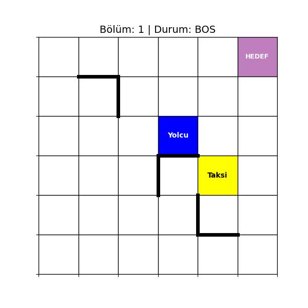

# Q Learning Taxi Problem

Bu projedeki problemde 6X6 grid içerisinde öğrenme ajanı olarak belirlenmiş taksinin bir yolcuyu duraktan alıp hedefe en kısa yoldan bırakması hedeflenmeiştir.

Taksiden beklenen;
Rastgele bir noktadan yolcuyu almak,
Engellere takılmadan (proje içerisinde belirlenen engeller taksinin içerisinden geçemeyi duvarlardır.) yolcuyu hedefe ulaştırmak,
Görevi en yüksek ödülle tamamlamaktadır.

# ORTAM TASARIMI

Grid içerisinde taksi boşken sarı, yolcu aldığında yeşil, yolcu mavi, hedef mor olarak belirlenmiştir.
Gymnasium kütüphanesinin 6x6'lık grid oluşturmaya izin vermemesi sebebiyle Gymnasium mantığıyla uyumlu TaxiEnv6x6 isimli özel bir sınıf oluşturulmuştur.

Boyut: 6x6 = 36 Hücre
Durum Uzayı: 1080 olası durum
6 satır × 6 sütun
6 yolcu konumu (5 durak + taksi içinde)
5 olası hedef

Eylemler:
0: Güney
1: Kuzey
2: Doğu
3: Batı
4: Pickup
5: Dropoff

# ÖDÜL YAPISI

Her adım: -1 (Hedefe en kısa yoldan ulaşabilmesi için)
Yanlış alma/indirme denemesi: -10
Başarılı bırakma: +20 (bölüm tamamlanır)

# PROJE YAPISI

taxi_env.py – Ortamın oluşturulduğu sınıf, duvar tanımları ve görselleştirme fonksiyonları
train.py – Q-Learning eğitimi, test aşaması ve GIF oluşturma süreci
requirements.txt – Gerekli Python kütüphaneleri

# KURULUM VE ÇALIŞTIRMA

Repoyu klonlayın:
git clone https://github.com/almlal/taxi_q_learning.git
cd taxi_q_learning

Gerekli kütühaneleri yükleyin:
pip install -r requirements.txt

Ajanı eğitin:
python train.py

Eğitim tamamlandığında, ajanın performansını gösteren taxi_final.gif dosyası proje klasöründe oluşur.

Örnek bir simülasyon aşağıda verilmiştir:

